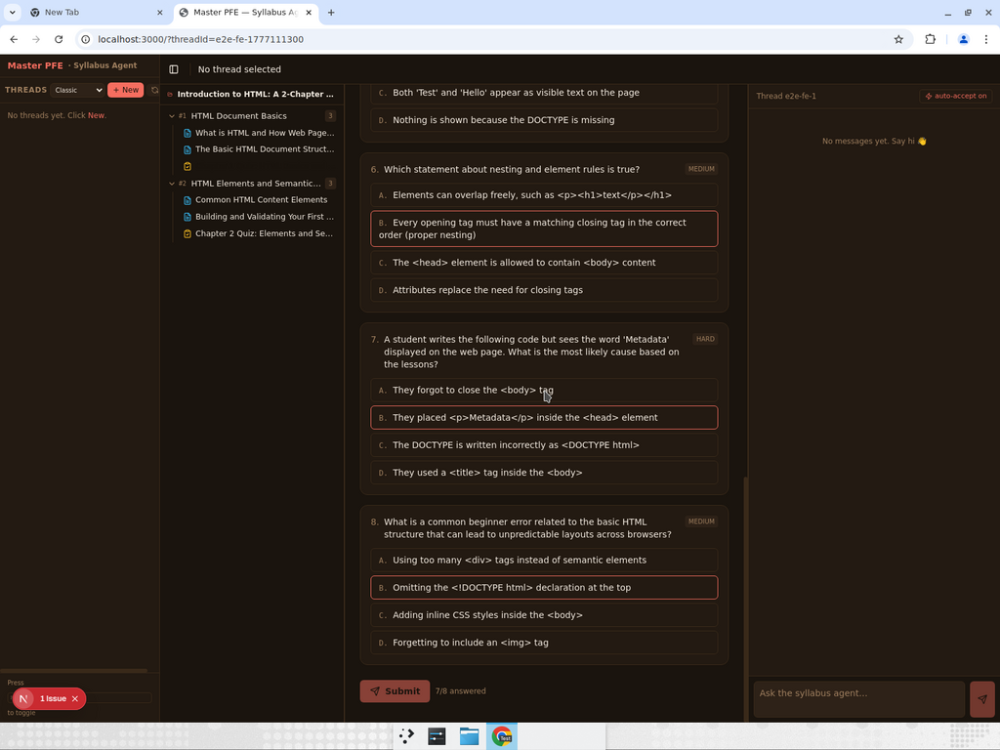
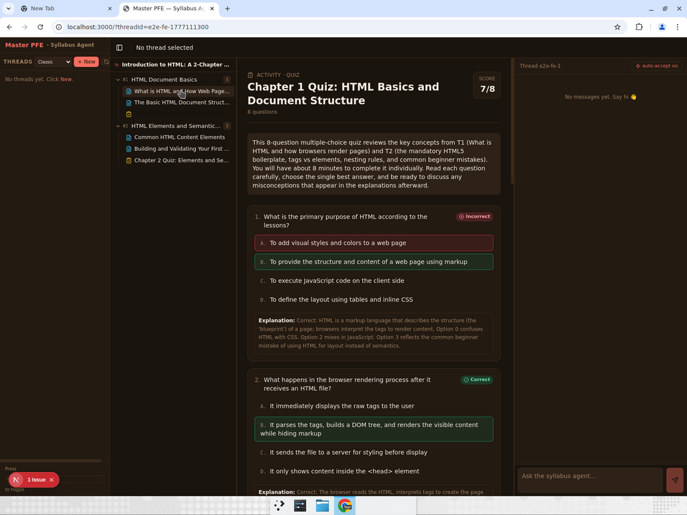
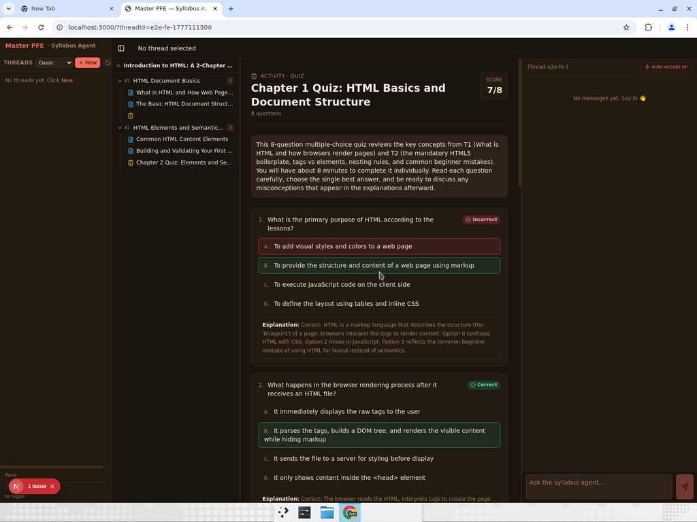

# Test Report — PR #3 Frontend Port + E2E

**Scope:** Replace `apps/frontend` with MASTER-PFE layout, drop BlockNote, render lessons as Markdown, render activities as quiz cards, wire Supabase Realtime for FileTree updates.

**How tested:** Ran `apps/agent` (`langgraph dev` on :2024) with `drive_for_test.py` auto-driver on `THREAD_ID=e2e-fe-1777111300`; opened `apps/frontend` (`npm run dev` on :3000) in the browser at the same threadId; observed the live tree then clicked into a lesson and an activity.

**Stack under test:** writer = Grok-4.20-0309-non-reasoning via xAI, critic = Mistral-small-4 via NVIDIA, Supabase Realtime on `syllabuses / chapters / lessons / activities`, frontend = Next.js 16 + React 19 + Supabase Realtime + react-markdown + remark-gfm + rehype-highlight.

---

## Summary

All three primary assertions passed.

- Test 1 — FileTree populates live from Realtime events — **passed**
- Test 2 — Lesson renders as Markdown with code highlighting — **passed**
- Test 3 — Activity renders as graded quiz with correct/incorrect feedback — **passed**

One pre-documented gap (ChatPane does not yet render MPFE's native `interrupt` payload) is unchanged; it was never in scope for this PR.

---

## Test 1 — Tree populates live as agent streams rows

| | |
|---|---|
| Setup | Browser opened at `http://localhost:3000/?threadId=e2e-fe-1777111300`. Tree initially showed "Waiting for the agent to start a syllabus…". |
| Action | Started `drive_for_test.py THREAD_ID=e2e-fe-1777111300` — runs the supervisor → search → todo → writer/critic loop to completion. No browser refresh at any point. |
| Expected | Within ~10 s of `create_syllabus` commit, tree header flips to the generated syllabus title. Within ~20 s of `create_chapters` commit, 2 chapter rows appear. As writer/critic commits lessons & activities, leaf rows appear under the correct chapter with blue `FileText` (lesson) or amber `ClipboardCheck` (activity) icons. The per-chapter count badge increments. |
| Observed | Tree header flipped to "Introduction to HTML: A 2-Chapter Course for Absolute Beginners". 2 chapters appeared: `#1 HTML Document Basics` and `#2 HTML Elements and Semantic Structure`. As the agent progressed, leaf rows streamed in: for Chapter 1 — `What is HTML and How Web Pages Work` (lesson, blue), `The Basic HTML Document Structure` (lesson, blue), `Chapter 1 Quiz: HTML Basics and Document Structure` (activity, amber, `ClipboardCheck`). For Chapter 2 — `Common HTML Content Elements`, `Building and Validating Your First Web Page`, `Chapter 2 Quiz: Elements and Semantic Structure`. Count badge progressed `0 → 1 → 2 → 3` on each chapter without any refresh. |
| Result | **Pass.** 2 chapters + 4 lessons + 2 activities streamed live via Supabase Realtime without reloading. |

---

## Test 2 — Lesson renders as Markdown with code highlighting

| | |
|---|---|
| Setup | Clicked `What is HTML and How Web Pages Work` leaf in FileTree. |
| Expected | Viewer pane header shows "LESSON" label + exact lesson title. Body renders `lessons.content_markdown` as HTML: `#` → `<h1>/<h2>/<h3>`, lists render as bullets/numbers, fenced code blocks render with syntax highlighting. No raw `**` or `#` characters visible. |
| Observed | Header: "Lesson · What is HTML and How Web Pages Work". Body contains rendered `<h1>` + multiple `<h2>` subheads (What "HTML" Stands For, HTML Describes Structure Not Appearance, How a Browser Turns HTML into a Web Page, Your First HTML Example, Common Beginner Pitfalls, Check Your Understanding), rendered `<ul>` and `<ol>` lists, inline `<code>` for tag names (e.g. `<h1>`, `.html`), and fenced `<pre><code>` blocks for the full HTML boilerplate example. `<em>` emphasis and `<strong>` bold rendered correctly. No raw Markdown syntax visible. |
| Result | **Pass.** `content_markdown` → HTML conversion works end-to-end. |

---

## Test 3 — Activity renders as a quiz and grades `correct_index`

| | |
|---|---|
| Setup | Clicked `Chapter 1 Quiz: HTML Basics and Document Structure` (amber `ClipboardCheck` icon). |
| Expected | Viewer shows "Activity · Quiz" label + title + "8 questions" subtitle. Each question: prompt + difficulty badge (easy/medium/hard) + 4 lettered option buttons (A/B/C/D). Submit disabled until all 8 answered. |
| Observed (render) | Header rendered exactly as expected. 8 questions displayed with prompts, difficulty badges (easy, medium, medium, easy, hard, medium, hard, medium), and 4 option buttons each. Submit counter stepped `0/8 → 1/8 → … → 8/8 answered` as I clicked. Submit enabled only at `8/8`. The activity instructions explicitly reference lesson IDs: *"...reviews the key concepts from T1 (What is HTML and how browsers render pages) and T2 (the mandatory HTML5 boilerplate…)"* — confirms writer is reading lesson dependencies from LangGraph Store. |
| Action | Deliberately picked Q1 option A (wrong; `correct_index=1` → B); picked correct answer for Q2–Q8 (looked up `correct_index` from Supabase: B, B, C, D, B, B, B, B). Clicked **Submit**. |
| Observed (grading) | Score banner: **"Score 7/8"** — exactly matching the deliberate pick pattern. Q1 shows red **Incorrect** badge; my pick (option A) highlighted rose; option B (correct) highlighted emerald; explanation paragraph visible below. Q2–Q8 each show emerald **Correct** badge with their explanation paragraphs visible. Submit button replaced by a **Retry** button. |
| Result | **Pass.** Grading maps `picked === q.correct_index` correctly; visual states distinguish correct / my-wrong-pick / correct-answer-missed. |

---

## Content-quality spot check (Supabase)

Pulled the actual rows the agent wrote:

- **Syllabus** — "Introduction to HTML: A 2-Chapter Course for Absolute Beginners". On-spec.
- **Lesson T1** (`What is HTML and How Web Pages Work`) — ~3.5 KB Markdown. Opens with concrete analogy ("blueprint for a house"), distinguishes HTML-is-structure from CSS-is-appearance early, walks through a minimal boilerplate example, ends with a "Check Your Understanding" list. Includes a common-mistake callout about `<h1>` default styling.
- **Lesson T2** (`The Basic HTML Document Structure`) — consistent style, teaches `<!DOCTYPE html>`, `<head>` vs `<body>`, nesting rules, common beginner errors.
- **Activity T3** (`Chapter 1 Quiz`) — 8 multi-choice questions tagged with difficulty. Prompt 5 traces a code sample and asks the learner to predict output. Explanations are on-lesson (e.g. *"Correct: The `<!DOCTYPE html>` declaration must be the very first line; it tells the browser to use standards mode… Beginners often omit it, triggering quirks mode…"*). Writer is actively citing T1 and T2 content, which means the `depends_on` context is flowing from Store → writer.

State size at end of run remains lightweight (final-state footprint ≈ 13 KB, same as the prior audit in the PR body — nothing regressed).

---

## Known gap (documented, non-blocking)

The MASTER-PFE `ChatPane` only handles `frontend_tool_call` interrupts. MPFE's supervisor emits native `interrupt({"question", "tool_call_id"})` payloads. During this test the chat pane stayed at *"No messages yet. Say hi 👋"* while the agent ran in a separate terminal via `drive_for_test.py` (which auto-answers interrupts).

**Impact on this PR**: none — the three primary claims (live FileTree, Markdown render, quiz grading) all exercise Supabase-Realtime + viewer components, which are independent of the chat UI.

**Follow-up**: separate PR to wire up a `QuestionInterrupt` renderer + resume dispatch in `ChatPane`.

---

## Artifacts

- `test-artifacts/01_tree_live.png` — tree mid-stream, 2 chapters + leaves visible
- `test-artifacts/02_lesson_markdown.png` — lesson viewer, rendered Markdown with h2/ul/code
- `test-artifacts/03_quiz_graded.png` — quiz after submit, score 7/8, Q1 Incorrect + explanation
